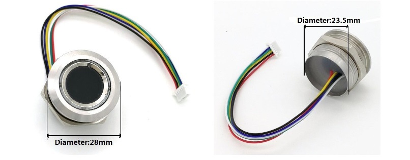

# R503-fingerprint-sensor-and-SSD1306-display-on-Arduino-device
An Arduino sketch using a SSD1306 128 X 2 display like this 

with an R503 sensor like this

# Info 
Whilst this initial coding attempt seems to work fine - it doesn't win any coding beauty prizes :)

Please note:
 - Arduinos Libraries - To get this sketch to complile in the Arduino IDE, you need to import the following libraries
   - "SSD1306Ascii" - Text display on small monochrome OLED Modules (by Bill Greiman)
   - "Adafruit Fingerprint Sensor library" (by Adafruit)
- Connections - to get everything connected, use female to female Dupont wires
  - The finger print display is powered with the 3.3v line and 0V (ground)
  - The finger print sensor communicates via digital pins 2 and 3 (See pdf for more info). The connections are:
    - wire 1 and Wire 6 <-> Arduino 3.3V
    - Wire 2 <-> Arduino 0V
    - Wire 3 <-> Arduino RX    
    - Wire 4 <-> Arduino TX    
  - The SSD1306 display is powered with the 5v line and 0V (ground)
  - The SSD1306 display communicates with the Arduino's I2C pins - A4(SDA) and A5(SCL). 
